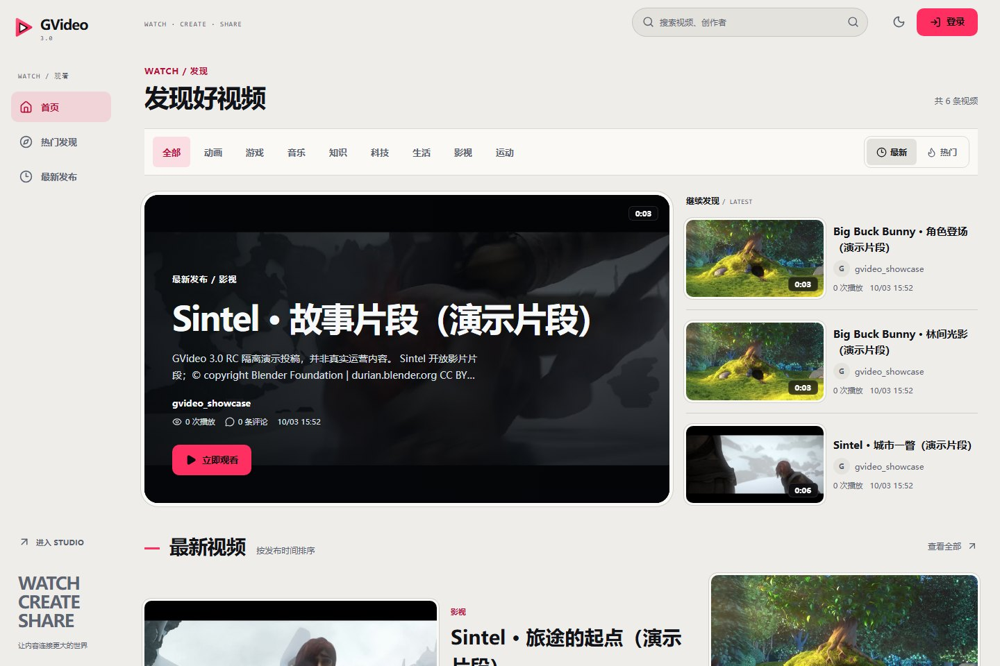
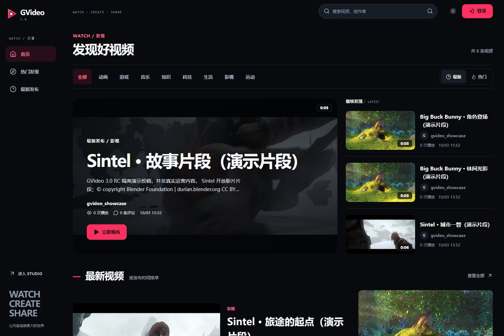
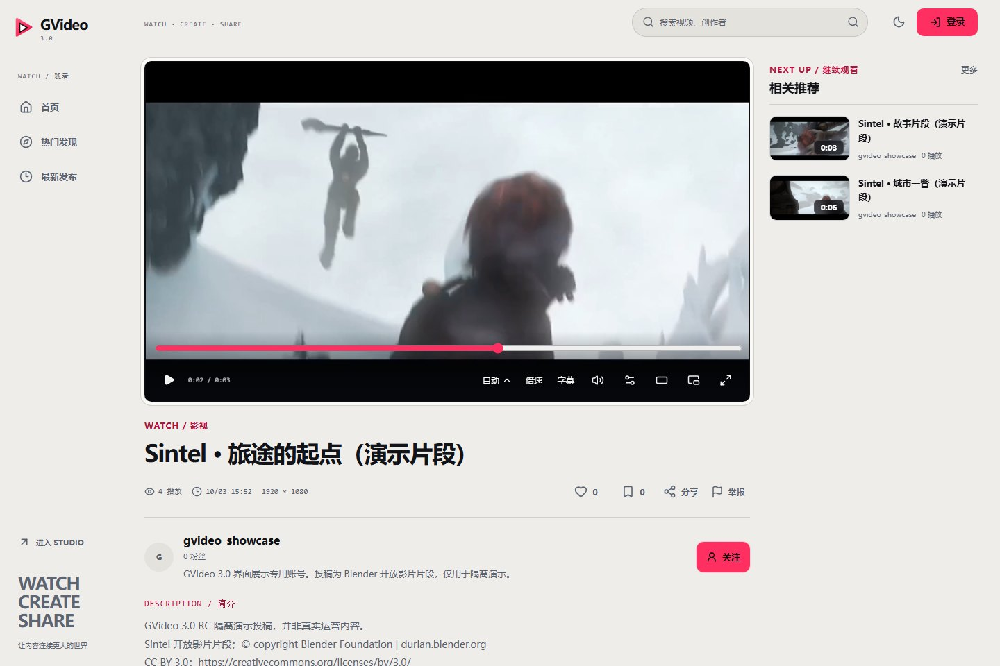
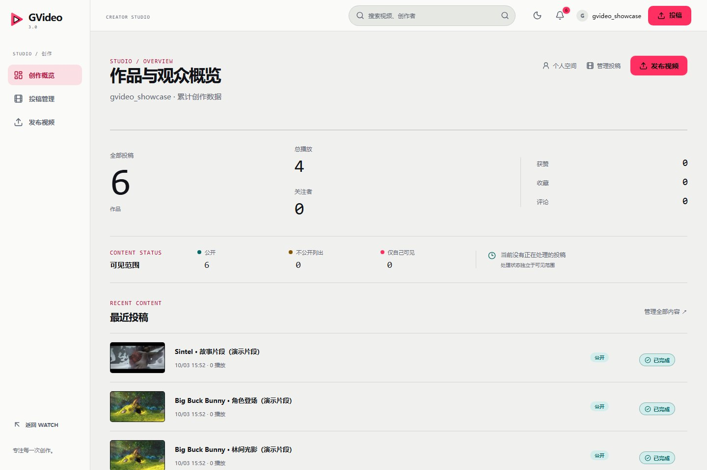
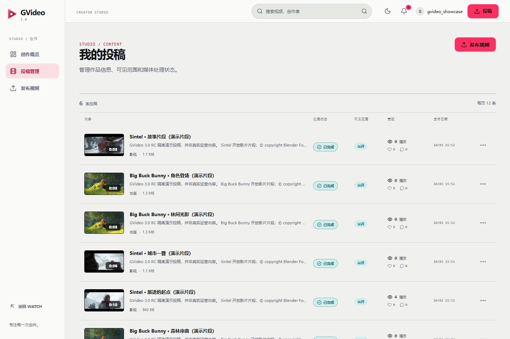
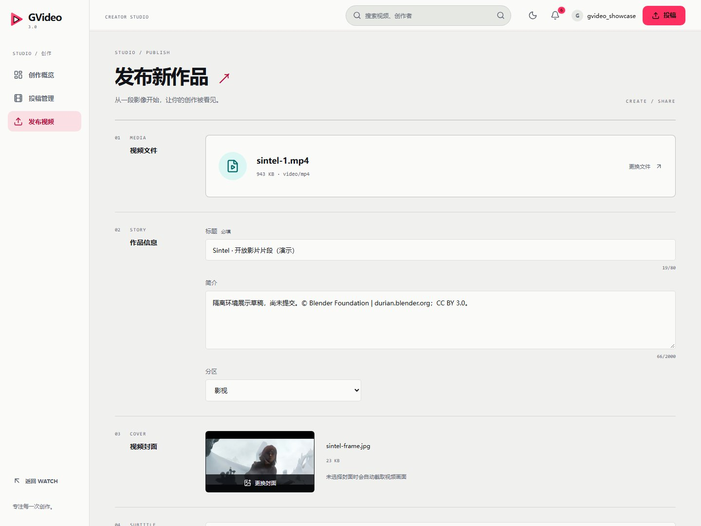
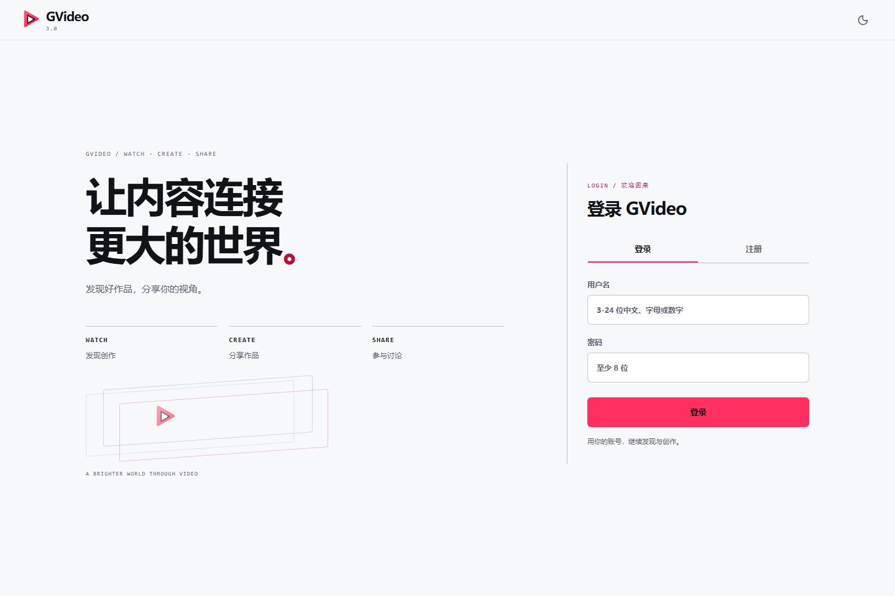
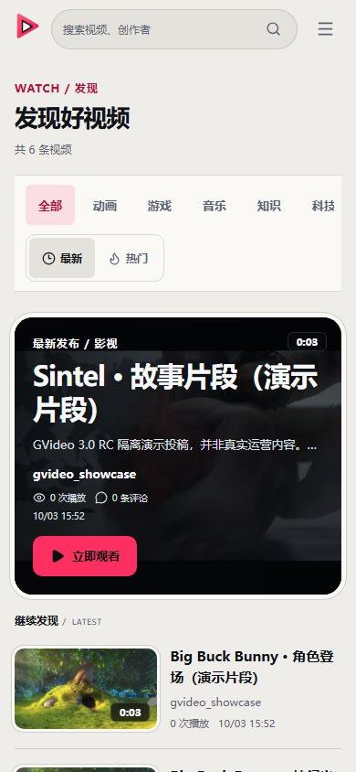

# GVideo

GVideo 是一个面向视频创作者与观众的社区型全栈项目。项目参考成熟视频社区的常见使用习惯，但产品设计、代码和架构均独立实现，当前以可部署、可维护的模块化单体为核心。

当前版本已打通注册登录、视频投稿、媒体处理、发现与播放、作者空间、关注动态、点赞收藏、评论通知、举报审核、创作者工作台和字幕管理等主要流程。

当前 UI 为 **GVideo 3.0 Release Candidate**：Phase 1–6 已完成工程与视觉验收，RC 基线为 [`e2c3a63`](https://github.com/zdl000000/GVideo/commit/e2c3a63fb84faea647d396b5e0ff622d535e09ba)（[PR #43](https://github.com/zdl000000/GVideo/pull/43)）。这次 UI 重构没有发布 `v3.0.0` 正式版或部署生产环境。

- **WATCH**：内容发现、播放与评论、创作者频道，媒体优先的阅读层次与响应式布局。
- **STUDIO**：创作概览、投稿管理、发布与字幕工作流；字幕管理继续只在 `/me/videos`。
- **Auth / Activity / Governance**：登录注册、通知中心与管理员审核，沿用原有权限和 API 契约。
- **主题**：默认 Light，可切换 Dark 并保存偏好；播放器在两种主题下均保留深色媒体表面。

## 界面展示

以下为 RC 实际运行界面，使用独立演示数据库中的开放影片片段。账号、投稿与统计属于演示环境，不代表真实运营数据；截图未经界面合成或功能状态改写。

<p align="center"></p>

| WATCH Dark | 播放与评论 |
| --- | --- |
|  |  |

| STUDIO 概览 | 投稿管理 |
| --- | --- |
|  |  |

| 发布工作流 | 登录 |
| --- | --- |
|  |  |

<p align="center"></p>

演示媒体：Big Buck Bunny 与 Sintel，© Blender Foundation，[CC BY 3.0](https://creativecommons.org/licenses/by/3.0/)。片段经截取、编码，封面由实际视频提取；完整来源、署名与采集信息见 [展示素材说明](docs/assets/gvideo3/sources.md)。工程叙事见 [工程案例](docs/case-study.md)，领域词汇见 [CONTEXT.md](CONTEXT.md)，关键取舍见 [架构决策记录](docs/adr/)。

## RC 验收基线

以下为 `e2c3a63` 对应的 Phase 6 最终验收记录，并非本次文档更新重新运行或累加多轮测试的结果。

| 检查 | 结果 |
| --- | --- |
| Vitest | 252 passed（21 个文件） |
| 完整隔离 E2E | 229 passed / 11 conditional skipped / 0 failed；桌面与移动 Chromium 项目 |
| 真实环境只读回归 | 48 passed |
| Nginx 安全响应头 | 12 passed |
| Typecheck / build / bundle budget / `scripts/check.ps1` | passed |

WebKit / Safari、native HLS 浏览器播放、实体手机与 HTTPS/TLS 未完成实测；部分真实持久操作仅验证模拟 API 契约，不能视作完整真实数据库写入验证。条件跳过、首轮失败及复验范围见 [Phase 6 验收报告](docs/gvideo3-phase6-acceptance.md)。

## 核心能力

- 服务端 Session、CSRF 防护、用户资料与头像管理
- MP4、WebM、Ogg 上传及真实文件头校验
- FFprobe 媒体探测、FFmpeg 自动封面和 HLS 自适应转码
- 首页、最新、热门、搜索、分区和服务端分页
- 视频播放、断点续播、清晰度选择、点赞、收藏和评论
- 作者空间、关注关系、关注动态和通知中心
- 创作者工作台、投稿编辑、处理进度、失败重试和删除
- `public`、`unlisted`、`private` 投稿可见性及媒体鉴权
- VTT/SRT 字幕上传、默认轨道切换和删除
- 用户举报与管理员审核
- 浅色默认主题和可选深色主题，保留已保存的主题偏好
- Docker Compose、HTTPS 网关、备份恢复和自动化验收脚本

字幕创作与管理仅位于 `/me/videos` 投稿管理流程，播放页只负责选择已有字幕轨道。

暂未实现弹幕、复杂推荐算法和微服务拆分。

## 技术栈

| 区域 | 技术 |
| --- | --- |
| 后端 | Go 1.26、Chi 5 |
| 前端 | React 19、TypeScript 7、Vite 8 |
| 数据 | SQLite、modernc.org/sqlite |
| 媒体 | FFprobe、FFmpeg、HLS、本地媒体目录 |
| 部署 | Docker Compose、Nginx |
| 测试 | Go test、Vitest、Playwright、PowerShell 验收脚本 |

## 快速开始

环境要求：

- Go 1.26 或更高版本
- Node.js 24 和 npm 11 或更高版本
- Docker Desktop 与 Docker Compose
- 仅在脱离 Docker 运行媒体处理时需要本机 FFmpeg 和 FFprobe

安装前端依赖：

```powershell
cd frontend
npm ci
cd ..
```

启动开发环境：

```powershell
.\scripts\dev.ps1
```

浏览器访问 `http://127.0.0.1:5173`。开发脚本使用 Docker 后端，因此 `5173` 与 Docker 页面 `8088` 共享同一套持久数据。

也可以直接启动完整 Docker 环境：

```powershell
docker compose up --build -d
```

访问 `http://127.0.0.1:8088`，健康检查地址为 `http://127.0.0.1:8080/healthz`。

## 验证

运行格式检查、后端测试与 vet、前端测试、类型检查和生产构建：

```powershell
.\scripts\check.ps1
```

完整验收会注册账号、上传媒体并修改互动、字幕等持久数据，**必须先准备并核对独立数据库与媒体卷，不得指向原开发库或生产库**。默认 `acceptance.ps1` 地址为 `8088`，会连接上面的共享开发数据；脚本不会自动创建隔离环境。环境准备、实际参数与当前 E2E 的隔离门禁见 [运维验收说明](docs/operations.md#完整验收)。

首次运行浏览器验收前安装 Chromium：

```powershell
cd frontend
npx playwright install chromium chromium-headless-shell
cd ..
```

验收脚本覆盖健康检查、真实 API 用户旅程、媒体处理、权限、互动、字幕和桌面/移动浏览器流程。`-IncludeBackupRestore` 还会触发备份恢复演练，须另外核对其目标 Compose 项目与恢复卷。

## 项目结构

```text
backend/
  cmd/server/             Go 服务入口
  internal/httpapi/       HTTP 路由、中间件与响应转换
  internal/service/       业务规则、权限和事务流程
  internal/repository/    SQLite 查询与数据映射
  internal/domain/        领域实体与稳定业务错误
  internal/media/         FFprobe、FFmpeg 与媒体任务 worker
  internal/platform/      数据库初始化和兼容迁移
frontend/
  src/app/                应用组合、路由守卫与 WATCH/STUDIO/Auth Shell
  src/features/           按业务能力组织的功能模块
  src/shared/             共享 API、组件、工具与类型
docs/                     架构、部署、运维、设计和开发规范
deploy/nginx/             HTTPS 网关配置
scripts/                  开发、检查、验收、备份和恢复脚本
```

前端已按 Feature-first 组织（保持 `app -> features -> shared` 依赖方向），后端按纵向模块切分并保留现有 API、数据库和部署兼容性。

## 文档导航

**工程与架构**

- [工程案例](docs/case-study.md)
- [架构与 Feature-first 迁移](docs/architecture.md)
- [架构决策记录](docs/adr/)
- [领域词表](CONTEXT.md)
- [公开开发路线](docs/roadmap.md)

**契约与可观测性**

- [API 错误契约](docs/api-error-contract.md)
- [Auth API 契约](docs/auth-api-contract.md)
- [可观测性契约](docs/observability.md)
- [告警与 Runbook 规格](docs/observability-alerts.md)

**流程与规范**

- [开发交接与原子任务清单](docs/development-handoff.md)
- [历史交付归档](docs/handoff-archive.md)
- [项目专项开发规范](docs/project-standards.md)
- [前端设计系统](docs/design-system.md)
- [GVideo 3.0 重构进度](docs/gvideo3-progress.md)
- [Phase 6 / RC 验收报告](docs/gvideo3-phase6-acceptance.md)
- [正式展示素材与媒体来源](docs/assets/gvideo3/sources.md)
- [贡献指南](.github/CONTRIBUTING.md)
- [安全策略](.github/SECURITY.md)
- [变更记录](CHANGELOG.md)

**部署与运维**

- [部署与配置](docs/deployment.md)
- [运维、验收与备份恢复](docs/operations.md)

## 安全提示

- 不要提交 `.env`、证书、私钥、数据库、媒体、备份、日志或临时隧道状态。
- 生产环境必须使用 HTTPS 并设置 `COOKIE_SECURE=true`。
- 不要运行 `docker compose down -v`，除非明确需要永久删除数据库和媒体卷。
- 安全漏洞请按 [安全策略](.github/SECURITY.md) 私下报告，不要提交公开 Issue。

## 许可证

GVideo 使用 [MIT License](LICENSE)。
